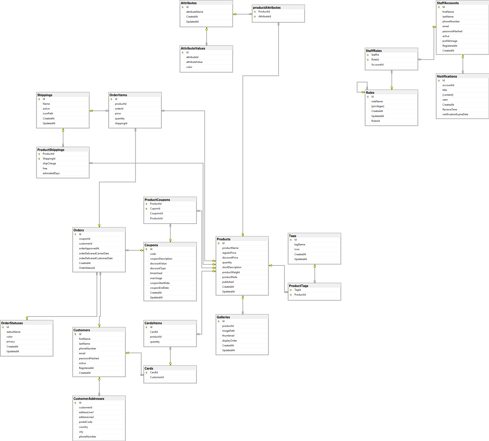

# eCommerce EF Core Project



## Introduction

This project is an eCommerce application built using Entity Framework Core (EF Core) as the ORM. The goal of this project is to provide a robust, scalable, and secure eCommerce platform with essential features such as product management, customer management, order processing, and more.

## Database Schema

The database schema consists of several tables to handle different aspects of the eCommerce platform:

- **Attributes**: Stores product attributes.
- **AttributeValues**: Stores possible values for each attribute.
- **Cards**: Stores customer card information.
- **CardsItems**: Stores items in customer cards.
- **Coupons**: Stores coupon codes and their details.
- **Customers**: Stores customer information.
- **CustomerAddresses**: Stores customer addresses.
- **Galleries**: Stores images for products.
- **Notifications**: Stores notifications for staff.
- **OrderItems**: Stores items in each order.
- **Orders**: Stores order details.
- **OrderStatuses**: Stores order status information.
- **ProductAttributes**: Associates attributes with products.
- **ProductCoupons**: Associates coupons with products.
- **ProductShippings**: Associates shipping methods with products.
- **Products**: Stores product details.
- **ProductTags**: Associates tags with products.
- **Roles**: Stores roles for staff members.
- **Shippings**: Stores shipping methods.
- **StaffAccounts**: Stores staff account information.
- **StaffRoles**: Associates roles with staff accounts.
- **Tags**: Stores tags for products.

## Tables Overview

### Attributes
| Column        | Type             | Description                         |
|---------------|------------------|-------------------------------------|
| Id            | int              | Primary key                         |
| attributeName | varchar(255)     | Name of the attribute               |
| CreatedAt     | date             | Creation date                       |
| UpdatedAt     | date             | Last update date                    |

### Coupons
| Column           | Type             | Description                         |
|------------------|------------------|-------------------------------------|
| Id               | int              | Primary key                         |
| code             | varchar(255)     | Coupon code                         |
| couponDescription| varchar(255)     | Description of the coupon           |
| discountValue    | decimal(18,2)    | Discount value                      |
| discountType     | varchar(55)      | Type of discount                    |
| timesUsed        | int              | Number of times used                |
| maxUsage         | int              | Maximum usage limit                 |
| couponStartDate  | date             | Start date of the coupon            |
| couponEndDate    | date             | End date of the coupon              |
| CreatedAt        | date             | Creation date                       |
| UpdatedAt        | date             | Last update date                    |

### Customers
| Column           | Type             | Description                         |
|------------------|------------------|-------------------------------------|
| Id               | int              | Primary key                         |
| firstName        | varchar(100)     | First name of the customer          |
| lastName         | varchar(100)     | Last name of the customer           |
| phoneNumber      | varchar(255)     | Phone number of the customer        |
| email            | varchar(100)     | Email address of the customer       |
| passwordHashed   | varchar(150)     | Hashed password                     |
| active           | bit              | Whether the customer is active      |
| RegisteredAt     | date             | Registration date                   |
| CreatedAt        | date             | Creation date                       |

### CustomerAddresses
| Column        | Type             | Description                         |
|---------------|------------------|-------------------------------------|
| Id            | int              | Primary key                         |
| customerId    | int              | Foreign key referencing Customers   |
| addressLine1  | varchar(255)     | Address line 1                      |
| addressLine2  | varchar(255)     | Address line 2                      |
| city          | varchar(100)     | City                                |
| state         | varchar(100)     | State                               |
| zipCode       | varchar(20)      | ZIP code                            |
| country       | varchar(100)     | Country                             |
| CreatedAt     | date             | Creation date                       |
| UpdatedAt     | date             | Last update date                    |

### Galleries
| Column        | Type             | Description                         |
|---------------|------------------|-------------------------------------|
| Id            | int              | Primary key                         |
| productId     | int              | Foreign key referencing Products    |
| imageUrl      | varchar(255)     | URL of the image                    |
| CreatedAt     | date             | Creation date                       |
| UpdatedAt     | date             | Last update date                    |

### Notifications
| Column        | Type             | Description                         |
|---------------|------------------|-------------------------------------|
| Id            | int              | Primary key                         |
| staffId       | int              | Foreign key referencing StaffAccounts|
| message       | varchar(255)     | Notification message                |
| readStatus    | bit              | Read status                         |
| CreatedAt     | date             | Creation date                       |
| UpdatedAt     | date             | Last update date                    |

### OrderItems
| Column        | Type             | Description                         |
|---------------|------------------|-------------------------------------|
| Id            | int              | Primary key                         |
| orderId       | int              | Foreign key referencing Orders      |
| productId     | int              | Foreign key referencing Products    |
| quantity      | int              | Quantity of the product             |
| unitPrice     | decimal(18,2)    | Unit price of the product           |
| CreatedAt     | date             | Creation date                       |
| UpdatedAt     | date             | Last update date                    |

### Orders
| Column        | Type             | Description                         |
|---------------|------------------|-------------------------------------|
| Id            | int              | Primary key                         |
| customerId    | int              | Foreign key referencing Customers   |
| orderStatusId | int              | Foreign key referencing OrderStatuses|
| orderDate     | date             | Date of the order                   |
| totalAmount   | decimal(18,2)    | Total amount of the order           |
| shippingAddressId | int          | Foreign key referencing CustomerAddresses |
| CreatedAt     | date             | Creation date                       |
| UpdatedAt     | date             | Last update date                    |

### OrderStatuses
| Column        | Type             | Description                         |
|---------------|------------------|-------------------------------------|
| Id            | int              | Primary key                         |
| status        | varchar(100)     | Status description                  |
| CreatedAt     | date             | Creation date                       |
| UpdatedAt     | date             | Last update date                    |

### ProductAttributes
| Column        | Type             | Description                         |
|---------------|------------------|-------------------------------------|
| Id            | int              | Primary key                         |
| productId     | int              | Foreign key referencing Products    |
| attributeId   | int              | Foreign key referencing Attributes  |
| attributeValueId | int           | Foreign key referencing AttributeValues |
| CreatedAt     | date             | Creation date                       |
| UpdatedAt     | date             | Last update date                    |

### ProductCoupons
| Column        | Type             | Description                         |
|---------------|------------------|-------------------------------------|
| Id            | int              | Primary key                         |
| productId     | int              | Foreign key referencing Products    |
| couponId      | int              | Foreign key referencing Coupons     |
| CreatedAt     | date             | Creation date                       |
| UpdatedAt     | date             | Last update date                    |

### ProductShippings
| Column        | Type             | Description                         |
|---------------|------------------|-------------------------------------|
| Id            | int              | Primary key                         |
| productId     | int              | Foreign key referencing Products    |
| shippingId    | int              | Foreign key referencing Shippings   |
| CreatedAt     | date             | Creation date                       |
| UpdatedAt     | date             | Last update date                    |

### Products
| Column        | Type             | Description                         |
|---------------|------------------|-------------------------------------|
| Id            | int              | Primary key                         |
| name          | varchar(255)     | Name of the product                 |
| description   | text             | Description of the product          |
| price         | decimal(18,2)    | Price of the product                |
| stockQuantity | int              | Quantity in stock                   |
| CreatedAt     | date             | Creation date                       |
| UpdatedAt     | date             | Last update date                    |

### ProductTags
| Column        | Type             | Description                         |
|---------------|------------------|-------------------------------------|
| Id            | int              | Primary key                         |
| productId     | int              | Foreign key referencing Products    |
| tagId         | int              | Foreign key referencing Tags        |
| CreatedAt     | date             | Creation date                       |
| UpdatedAt     | date             | Last update date                    |

### Roles
| Column        | Type             | Description                         |
|---------------|------------------|-------------------------------------|
| Id            | int              | Primary key                         |
| roleName      | varchar(100)     | Name of the role                    |
| CreatedAt     | date             | Creation date                       |
| UpdatedAt     | date             | Last update date                    |

### Shippings
| Column        | Type             | Description                         |
|---------------|------------------|-------------------------------------|
| Id            | int              | Primary key                         |
| method        | varchar(100)     | Shipping method                     |
| cost          | decimal(18,2)    | Shipping cost                       |
| CreatedAt     | date             | Creation date                       |
| UpdatedAt     | date             | Last update date                    |

### StaffAccounts
| Column        | Type             | Description                         |
|---------------|------------------|-------------------------------------|
| Id            | int              | Primary key                         |
| username      | varchar(100)     | Username                            |
| passwordHashed| varchar(150)     | Hashed password                     |
| email         | varchar(100)     | Email address                       |
| active        | bit              | Whether the account is active       |
| CreatedAt     | date             | Creation date                       |
| UpdatedAt     | date             | Last update date                    |

### StaffRoles
| Column        | Type             | Description                         |
|---------------|------------------|-------------------------------------|
| Id            | int              | Primary key                         |
| staffId       | int              | Foreign key referencing StaffAccounts|
| roleId        | int              | Foreign key referencing Roles       |
| CreatedAt     | date             | Creation date                       |
| UpdatedAt     | date             | Last update date                    |

### Tags
| Column        | Type             | Description                         |
|---------------|------------------|-------------------------------------|
| Id            | int              | Primary key                         |
| tagName       | varchar(100)     | Name of the tag                     |
| CreatedAt     | date             | Creation date                       |
| UpdatedAt     | date             | Last update date                    |


## Getting Started

### Prerequisites

- .NET 5.0 or later
- SQL Server

### Installation

1. Clone the repository:
   ```sh
   git clone https://github.com/fares7elsadek/Ecommerce-EF-Core-Project.git

2. Update the database connection string in `appsettings.json`.

3. Apply migrations to the database:
    ```sh
   dotnet ef database update


